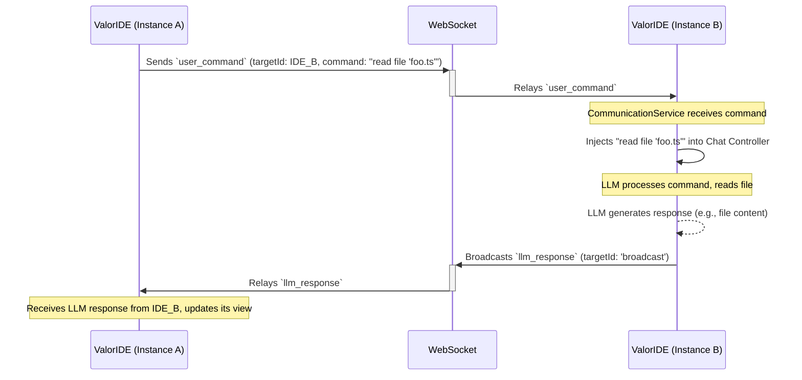

# ValorIDE Peer-to-Peer (P2P) Websocket Communication Protocol

## 1. Overview

This document outlines the architecture for a bidirectional websocket communication protocol enabling ValorIDE instances to interact with each other in real-time. This system extends the existing notification mechanism to support peer-to-peer chat, remote command execution, and the foundation for collaborative AI swarms.

The core principle is to create a standardized message envelope that can carry different types of payloads, allowing for a flexible and extensible communication system.

## 2. Goals

- **IDE-to-IDE Chat:** Allow an LLM in one ValorIDE instance to chat with another.
- **Remote Control:** Enable one ValorIDE instance to send commands (as if a user were typing) to another.
- **Real-time Collaboration:** Synchronize state and actions between multiple connected instances.
- **Extensibility:** Create a protocol that can be expanded with new message types for future capabilities like AI agent swarming.

## 3. Message Envelope Structure

All messages sent over the websocket will adhere to a standard envelope structure. This ensures consistency and simplifies message routing and processing.

```json
{
  "sourceId": "<string>",
  "targetId": "<string|'broadcast'>",
  "messageId": "<string>",
  "type": "<MessageType>",
  "payload": {
    // Payload specific to the message type
  },
  "timestamp": "<ISO 8601 string>"
}
```

- `sourceId`: A unique identifier for the sending ValorIDE instance.
- `targetId`: The unique identifier of the recipient instance. Can be set to `'broadcast'` to send to all connected peers.
- `messageId`: A unique UUID for the message, used for tracking and potential reply correlation.
- `type`: An enum string defining the nature of the payload. See `MessageType` section below.
- `payload`: A JSON object containing the data for the specific message type.
- `timestamp`: An ISO 8601 formatted timestamp indicating when the message was sent.

## 4. Message Types (`MessageType`)

### a. `llm_response`

This message type is used to "echo" the response from the local LLM to other peers. It allows other instances to see the conversation progress.

**Payload Structure:**
```json
{
  "taskId": "<string>",
  "llmResponse": {
    // The complete assistant message object, including any tool calls or content
  }
}
```

**Flow:**
1. User sends a prompt to the local ValorIDE.
2. The LLM processes it and generates a response.
3. After processing, the `ValkyraiLlmService` (or equivalent) broadcasts an `llm_response` message to all peers.

### b. `user_command`

This message type is used to send a command to another ValorIDE instance, which will be treated as if it were user input. This is the core of the remote control functionality.

**Payload Structure:**
```json
{
  "taskId": "<string|null>",
  "command": "<string>",
  "args": {}
}
```
- `taskId`: If specified, the command is executed within the context of an existing task. If `null`, a new task is created.
- `command`: The text prompt to be injected into the recipient's chat view.
- `args`: (Reserved for future use) Additional arguments or context for the command.

**Flow:**
1. The sending ValorIDE instance (e.g., via an LLM tool call) constructs a `user_command` message.
2. It sends this message to a specific `targetId`.
3. The recipient's `CommunicationService` receives the message.
4. It validates the message and then injects the `command` into its chat controller, simulating user input.

## 5. Sequence Diagram



## 6. Implementation Details

- **`CommunicationService`:** This service will be updated to handle both sending and receiving messages. It will contain a message router that looks at the `type` field and dispatches the payload to the appropriate handler.
- **`ChatController` / `Task`:** The main chat logic will need a method to accept inbound commands and inject them into the conversation flow.
- **`ValkyraiLlmService`:** This service will be modified to emit `llm_response` messages after a successful interaction.

This architecture provides a robust and scalable foundation for advanced inter-agent communication within the ValorIDE ecosystem.
