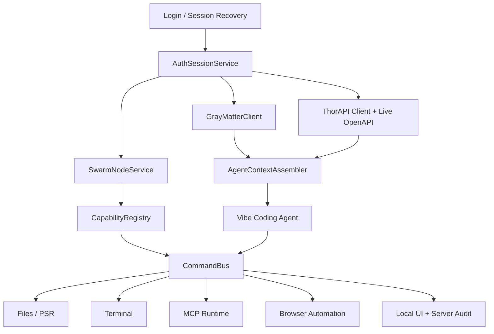

# ValorIDE Agentic Overhaul PRD

**Date:** 2026-05-13  
**Status:** Draft for implementation planning  
**Product Area:** ValorIDE, ValkyrAI, GrayMatter, SWARM, MCP, ThorAPI  
**Primary Repo:** `/Users/johnmcmahon/workspace/2025/valkyr/ValorIDE`

## 1. Executive Summary

ValorIDE must become a first-class ValkyrAI/GrayMatter client and a reliable local agentic node in the SWARM. The immediate trigger is a login failure against `api-0.valkyrlabs.com`, but the larger product gap is that auth, generated ThorAPI client updates, GrayMatter memory, SWARM registration, MCP runtime, local command execution, and the webview UX are still treated as adjacent features instead of one cohesive agent platform.

This PRD defines the requirements for a staged overhaul that makes ValorIDE:

- reliably authenticate against `https://api-0.valkyrlabs.com/v1`;
- auto-sync the latest ValkyrAI ThorAPI client and tightly coupled generated components;
- share GrayMatter memory through server-side RBAC;
- register as an available SWARM agent with ack/nack, heartbeat, command RPC, and audit visibility;
- expose local read/write/command execution safely to the swarm;
- install, run, monitor, and invoke MCP services from the ValkyrAI catalog;
- present a simpler, clearer, more powerful UX for login, signup, model/prompt selection, MCP, SWARM, and vibe coding;
- support an eventual "eject from IDE" desktop app mode while preserving "dock back into VS Code" workflows.

## 2. Problem Statement

ValorIDE has many of the required building blocks, but they are fragmented:

- Auth can fail with misleading stale-session errors, especially when local state, cookies, or a bad base URL cause login to miss the `/v1` API path.
- ThorAPI client files are copied from ValkyrAI by hand, which makes schema drift likely after backend changes.
- GrayMatter exists in the live ValkyrAI schema, but ValorIDE does not yet treat it as the primary durable memory and shared object graph.
- SWARM protocol helpers exist in `src/shared/swarm-protocol.ts`, and there is early orchestration in `src/services/swarmOrchestrator.ts`, but ValorIDE is not yet a fully registered, visible, routable local SWARM node.
- MCP support exists in `src/services/mcp/McpHub.ts` and webview MCP components, but catalog install/download/run/status flows are not reliable enough to make MCP a power feature.
- The vibe coding experience can stall, underuse tools, and fail to surface precision search/replace feedback, fallback editing, ThorAPI affordances, and GrayMatter standards.
- The UX hides important account, signup, model, prompt, SWARM, and MCP controls behind too much incidental interface.

## 3. Goals

### G1. Auth Never Silently Breaks

Users can always recover from expired, replaced, malformed, stale, or conflicting auth state. Login must use the canonical API base path and must not send stale credentials.

### G2. ThorAPI Client Drift Is Removed

ValorIDE can refresh its embedded ThorAPI client and support files from the sibling ValkyrAI checkout through a repeatable script with validation, dry-run, CI checks, and visible schema-drift reporting.

### G3. GrayMatter Is First-Class

ValorIDE uses GrayMatter as primary durable memory and organization-aware object graph context. All GrayMatter operations respect server-side RBAC and never bypass permissions through local state.

### G4. ValorIDE Joins The SWARM

On successful auth, ValorIDE registers itself with ValkyrAI as an available local agent node, announces capabilities, sends heartbeats, accepts or rejects commands with ack/nack, and exposes command visibility to both the user and the server.

### G5. Local Agentic Execution Is Modular And Safe

ValorIDE local capabilities such as file read/write, PSR edits, terminal execution, browser automation, and MCP tools are exposed through a unified command bus that can be used locally, from the CLI, and from SWARM RPC with approval policy and audit logging.

### G6. MCP Becomes A Reliable Tool Runtime

Users can discover MCP services from the ValkyrAI catalog, install them, run them, see status/errors/logs, invoke tools/resources, and recover from broken server configs without editing JSON by hand.

### G7. UX Becomes Clear And Operator-Grade

The first screen must make account state, signup/login, selected model, selected prompt/persona, MCP availability, SWARM connection, and active local capabilities obvious without explanatory clutter.

### G8. Prepare For Ejectable Desktop Mode

ValorIDE remains a VS Code extension first, but the architecture separates IDE-bound services from portable Electron shell services so a session can "eject" into a standalone app and "return to dock" later.

## 4. Non-Goals

- Do not bypass ValkyrAI RBAC or infer permissions client-side.
- Do not grant SWARM peers unrestricted local filesystem or shell access.
- Do not replace ThorAPI generation in ValkyrAI in this work; this PRD covers ValorIDE sync and consumption.
- Do not rebuild the entire VS Code extension shell before the auth, SWARM, GrayMatter, and MCP foundations are stable.
- Do not hand-roll MCP protocol behavior that the official MCP SDK already provides.

## 5. Current Implementation Anchors

These files and docs are relevant starting points:

- Auth and base path:
  - `webview-ui/src/redux/customBaseQuery.tsx`
  - `webview-ui/src/utils/valkyraiHost.ts`
  - `src/utils/serverValkyraiHost.ts`
  - `src/core/storage/state.ts`
  - `src/core/controller/index.ts`
- ThorAPI sync:
  - `scripts/sync-thorapi-from-valkyrai.mjs`
  - `docs/architecture/thorapi-client-upgrade-checklist.md`
  - `webview-ui/src/thorapi`
- SWARM:
  - `src/shared/swarm-protocol.ts`
  - `src/services/swarmOrchestrator.ts`
  - `src/services/swarmPromptBroadcaster.ts`
  - `docs/architecture/valoride-p2p-websockets.md`
  - `.valorideDELETE/docs/SWARM_V2_ARCHITECTURE_VISION.md`
- MCP:
  - `src/services/mcp/McpHub.ts`
  - `webview-ui/src/components/mcp`
  - `src/shared/mcp.ts`
  - `docs/mcp/README.md`
- Agentic execution and anti-stall:
  - `src/core/task/index.ts`
  - `src/core/task/tools`
  - `docs/COMMAND-STALL-PREVENTION.md`
  - `docs/tools/valoride-tools-guide.md`
- Prompt/vibe coding:
  - `src/core/prompts/system.ts`
  - `docs/VALOR_PROMPT_ENGINEERING.md`
  - `docs/valoride-instruct-cleanup-roadmap.md`
- ValkyrAI model pass-through:
  - `docs/valkyrai-llm-pass-through.md`
  - `src/api/providers/valkyrai.ts`
  - `src/api/providers/valoride.ts`

## 6. Personas And Jobs

### P1. Developer Driving ValorIDE

Wants to log in, select a strong model/prompt, run local file and terminal workflows, use MCP tools, and keep the agent from getting stuck.

### P2. ValkyrAI SWARM Operator

Wants to see which ValorIDE instances are online, assign work, route commands, inspect acks/nacks, and use local execution only where policy allows.

### P3. Enterprise Admin

Wants RBAC-controlled memory, audit logs, server-visible command activity, safe local execution defaults, and predictable account/session management.

### P4. App Builder Using ThorAPI

Downloads generated ValkyrAI/ThorAPI app frameworks and expects ValorIDE to understand generated models, services, OpenAPI shape, local test APIs, and H2-backed development servers.

## 7. Core User Journeys

### J1. Reliable Login And Recovery

1. User opens ValorIDE.
2. App displays current API host and account state.
3. User signs in to `api-0.valkyrlabs.com`.
4. ValorIDE clears stale local session artifacts before login.
5. Login uses `/v1/auth/login`.
6. On success, ValorIDE stores session securely, fetches principal, loads RBAC-scoped capabilities, and registers with SWARM.
7. On failure, UI states whether the issue is invalid credentials, unreachable host, expired/replaced session, CSRF/session conflict, or server rejection.

### J2. ThorAPI Refresh After ValkyrAI Schema Change

1. Developer runs `npm run sync:thorapi -- --dry-run`.
2. Script reports source, target, file count, schema timestamp/hash, and support files.
3. Developer runs `npm run sync:thorapi`.
4. Script copies latest ThorAPI into both extension and webview targets and applies ValorIDE runtime patches.
5. Validation runs typecheck, targeted auth tests, and generated import smoke tests.
6. PR includes generated client diff and schema summary.

### J3. ValorIDE Joins SWARM

1. User logs in.
2. ValorIDE creates or refreshes an Agent record for this local instance.
3. It announces capabilities: local filesystem, shell, browser, PSR, MCP services, workspace metadata, selected model, and approval policy.
4. Mothership responds with ACK or NACK plus current project/swarm assignment.
5. ValorIDE heartbeats status and accepts authorized commands through command RPC.
6. Each inbound command produces visible local UI, user approval if needed, server audit events, and ack/nack result.

### J4. GrayMatter Memory Access

1. ValorIDE loads live OpenAPI and RBAC-scoped GrayMatter capabilities after auth.
2. Agent queries GrayMatter for project standards, business rules, prior decisions, and schema knowledge.
3. Agent writes durable context, decisions, and artifacts to `MemoryEntry` where permitted.
4. Other agents see shared memory through ValkyrAI RBAC.
5. If GrayMatter is unavailable, ValorIDE queues or degrades gracefully without pretending writes succeeded.

### J5. MCP Catalog Install And Run

1. User opens MCP panel.
2. ValorIDE loads available MCP catalog entries from ValkyrAI.
3. User installs a selected service.
4. ValorIDE downloads/builds/configures service, prompts for required secrets, starts it, and verifies tools/resources.
5. MCP server status, stderr, logs, tools, resources, and retry actions are visible.
6. Agent can invoke MCP tools when policy allows.

### J6. Vibe Coding With Tool Transparency

1. User asks for a coding change.
2. Agent consults GrayMatter and project rules before planning.
3. Agent proactively uses ThorAPI client knowledge when generated functionality exists.
4. PSR edits show precise before/after feedback.
5. Fallback file editing is reliable and visibly audited.
6. Commands stream progress and never hang indefinitely.
7. Completion includes tests, changed files, and any GrayMatter memory updates.

### J7. Eject And Return To Dock

1. User clicks "Eject Session".
2. ValorIDE opens the same task/session in a standalone Electron shell.
3. VS Code extension enters a linked/docked state.
4. User can return session to IDE without losing chat, files, local tool state, MCP servers, or SWARM identity.

## 8. Functional Requirements

### 8.1 Auth And Account Reliability

- FR-AUTH-1: All auth requests must normalize to `https://api-0.valkyrlabs.com/v1` unless the user explicitly configures another API base with a path.
- FR-AUTH-2: Login must clear stale local auth artifacts before submitting credentials.
- FR-AUTH-3: Login must not send stale bearer tokens or stale cookies.
- FR-AUTH-4: Auth state must be mirrored consistently between extension host and webview.
- FR-AUTH-5: The UI must show the active API host, principal, auth state, and recovery actions.
- FR-AUTH-6: Session-expired errors must clear stored auth and avoid repeated toast loops.
- FR-AUTH-7: Signup, forgot username, forgot password, and credit/account flows must be visible from the login/account surface.
- FR-AUTH-8: Account/session storage must use platform-secure storage where available and avoid leaking tokens to logs.

### 8.2 ThorAPI Sync And Generated Client Consumption

- FR-THOR-1: `npm run sync:thorapi` must copy from latest ValkyrAI ThorAPI source into `webview-ui/src/thorapi`; the extension host resolves generated ThorAPI imports through that canonical webview copy.
- FR-THOR-2: The sync script must support `--dry-run`, explicit source overrides, and support-file sync.
- FR-THOR-3: Sync must validate required folders: `api`, `model`, `redux`, `src`.
- FR-THOR-4: Sync must patch runtime base path mutability without manual edits.
- FR-THOR-5: Sync must produce a machine-readable report containing source commit/hash, file count, changed model/service names, and validation results.
- FR-THOR-6: CI must fail if generated clients are stale relative to the configured ValkyrAI source or if auth support files are missing.
- FR-THOR-7: Major schema changes must include component refresh for tightly coupled generated UI.
- FR-THOR-8: ValorIDE code must prefer generated ThorAPI services before custom REST wrappers.

### 8.3 GrayMatter Client

- FR-GM-1: After auth, ValorIDE must load live OpenAPI from `/v1/api-docs` and identify GrayMatter, MemoryEntry, Agent, SwarmOps, and related schema capabilities.
- FR-GM-2: ValorIDE must expose GrayMatter read/write/query operations to the agent runtime through a typed client.
- FR-GM-3: All GrayMatter operations must rely on ValkyrAI RBAC and surface 401/403/402 distinctly.
- FR-GM-4: Agent memory writes must classify records as `decision`, `todo`, `context`, `artifact`, or `preference`.
- FR-GM-5: GrayMatter context must be injected into vibe coding prompts as compact, cited operational context.
- FR-GM-6: ValorIDE must queue or mark failed memory writes for retry when offline, and must never report a failed durable write as successful.
- FR-GM-7: Users must be able to inspect what memory was read or written during a task.

### 8.4 SWARM Protocol And Mothership Registration

- FR-SWARM-1: ValorIDE must register or refresh an Agent/HostInstance record after login.
- FR-SWARM-2: Registration payload must include instance ID, principal, workspace summary, capabilities, approval policy, version, and selected model/prompt.
- FR-SWARM-3: Mothership registration must require ACK before ValorIDE accepts remote work.
- FR-SWARM-4: Mothership NACK must show actionable reasons in the UI.
- FR-SWARM-5: ValorIDE must heartbeat online/busy/error status and active task metadata.
- FR-SWARM-6: Inbound commands must use the shared `SwarmMessage` envelope and produce ACK/NACK with correlation IDs.
- FR-SWARM-7: Remote command execution must require RBAC, command signing or equivalent trust, and local approval policy.
- FR-SWARM-8: User-driven sessions may request resources/assistance from mothership; server-driven projects may request local capabilities from ValorIDE.
- FR-SWARM-9: All SWARM command activity must be visible locally and auditable server-side.

### 8.5 Local Agentic Command Bus

- FR-CMD-1: File reads, file writes, PSR edits, terminal commands, browser automation, MCP calls, and ThorAPI calls must share one command envelope and result contract.
- FR-CMD-2: Command results must include status, stdout/stderr or structured output, artifacts, elapsed time, tool identity, and approval status.
- FR-CMD-3: Long-running commands must stream progress and must be cancellable.
- FR-CMD-4: Command execution must retain current anti-stall protections and expand them for remote/SWARM commands.
- FR-CMD-5: Local execution capabilities must be announced to SWARM as granular permissions, not a single all-powerful capability.
- FR-CMD-6: The CLI, VS Code extension, and future Electron shell must use the same command bus contracts.

### 8.6 MCP Runtime And Catalog

- FR-MCP-1: MCP panel must show installed, enabled, disabled, failed, and catalog services.
- FR-MCP-2: Catalog entries must come from ValkyrAI/ThorAPI where available, with local fallback examples only for development.
- FR-MCP-3: Installing an MCP service must download/build/configure/start/verify it from a guided flow.
- FR-MCP-4: Required secrets must be requested explicitly and stored securely.
- FR-MCP-5: Server logs, stderr, startup errors, timeout settings, tools, resources, and resource templates must be visible.
- FR-MCP-6: Users must be able to restart, disable, uninstall, and repair a server.
- FR-MCP-7: Agent tool selection must include MCP tools when relevant, with feedback showing which MCP server/tool was used.
- FR-MCP-8: MCP calls must honor local approval policy and SWARM/RBAC constraints.

### 8.7 UX Overhaul

- FR-UX-1: First screen must expose account state, API host, signup/login, selected model, selected prompt/persona, SWARM state, MCP state, and current workspace.
- FR-UX-2: Important buttons must not be hidden in low-discoverability areas.
- FR-UX-3: Use a dense, utilitarian interface suited for repeated engineering work.
- FR-UX-4: Use clear icons/tooltips for tool actions and text labels for high-consequence commands.
- FR-UX-5: Avoid explanatory clutter inside the app; prefer status, affordances, and concise labels.
- FR-UX-6: Error messages must state the failing subsystem, recovery action, and whether user action is required.
- FR-UX-7: The UI must include a SWARM/MCP/GrayMatter capability command center.

### 8.8 Vibe Coding Reliability

- FR-VIBE-1: The system prompt must require proactive use of available ThorAPI services and generated client functionality.
- FR-VIBE-2: The agent must consult GrayMatter/project standards before substantial edits.
- FR-VIBE-3: PSR edits must show precision feedback: matched target, replacement summary, files changed, and fallback reason if PSR cannot be used.
- FR-VIBE-4: Fallback edits must be robust and must avoid silent partial writes.
- FR-VIBE-5: Tool usage policy must prefer structured tools over ad hoc text manipulation.
- FR-VIBE-6: Agent must be able to launch local lightweight ThorAPI/H2 test servers for generated app frameworks when available.
- FR-VIBE-7: Stuck detection must identify repeated failed tool calls, repeated failed commands, and no-progress loops.

### 8.9 Ejectable Desktop Mode

- FR-EJECT-1: Product architecture must define IDE-bound vs shell-portable services.
- FR-EJECT-2: Session state must be serializable for handoff between VS Code webview and standalone Electron shell.
- FR-EJECT-3: Ejected sessions must preserve auth, SWARM identity, MCP state, chat history, task state, and command permissions.
- FR-EJECT-4: Returning to dock must reconcile state without duplicating Agent registration.

## 9. Architecture Direction

### 9.1 Service Modules

Introduce or formalize these modules:

- `AuthSessionService`: secure session lifecycle, stale-state cleanup, token/cookie recovery.
- `ThorapiSyncService`: scripted sync orchestration and validation report handling.
- `GrayMatterClient`: typed memory/object graph access through ThorAPI services.
- `SwarmNodeService`: registration, heartbeat, ack/nack, command routing.
- `CommandBus`: shared local command execution contract.
- `McpRuntimeService`: catalog install, process lifecycle, status, tool/resource registry.
- `CapabilityRegistry`: single source of truth for local capabilities and approval policy.
- `AgentContextAssembler`: prompt context builder using GrayMatter, ThorAPI schema, workspace rules, and active task state.

### 9.2 High-Level Flow

## 10. Security, RBAC, And Audit Requirements

- All server-side resources must use authenticated ValkyrAI requests.
- GrayMatter and SWARM access must be denied by server-side RBAC, not by client filtering alone.
- Inbound SWARM commands must be tied to a principal, project, correlation ID, and approval policy.
- Local shell/file execution from remote commands must be deny-by-default until explicit policy allows it.
- Secrets must be stored in VS Code SecretStorage, OS keychain, or approved secure storage.
- Token, cookie, password, and secret values must be redacted from logs and UI.
- Audit events must include command type, source, target, approval mode, result, timing, and artifact references.

## 11. Observability And Product Metrics

### Reliability Metrics

- Login success rate by host and error class.
- Auth recovery success after stale session.
- ThorAPI sync validation pass rate.
- SWARM registration ACK rate.
- MCP server start success rate.
- Tool-call stuck-loop detections per task.

### Product Metrics

- Percent of active sessions with GrayMatter reads.
- Percent of tasks with durable GrayMatter writes.
- MCP tools invoked per active user.
- SWARM remote commands accepted/rejected.
- Time to first successful login.
- Time from MCP catalog selection to verified running server.
- User-visible task completion rate.

## 12. Acceptance Criteria

### Auth

- Login request in DevTools is always `/v1/auth/login` for api-0.
- No stale bearer token is sent on login.
- Clearing session state and retrying login is available from UI.
- Expired/replaced session errors do not create repeated API error overlays.

### ThorAPI

- `npm run sync:thorapi -- --dry-run` reports planned source/target operations.
- `npm run sync:thorapi` updates both ThorAPI target trees.
- Sync report identifies schema/source revision and changed service/model names.
- Typecheck and focused auth/ThorAPI smoke tests pass after sync.

### GrayMatter

- Successful login loads GrayMatter capability state.
- Agent can query and write MemoryEntry where RBAC permits.
- 401, 403, and credit/quota failures produce distinct UI states.
- Task transcript shows memory read/write summary.

### SWARM

- ValorIDE registers as an available agent after login.
- Mothership ACK/NACK is visible.
- Heartbeat updates online/busy/error state.
- Inbound command produces local approval UI, command execution, and ack/nack result.

### MCP

- Catalog install can download/build/start one known MCP service end-to-end.
- Broken MCP server displays actionable logs and repair/restart actions.
- Agent can invoke a verified MCP tool and show result provenance.

### UX

- Login/signup/model/prompt/SWARM/MCP states are visible without deep navigation.
- Error states identify subsystem and next action.
- Primary workflows work on the VS Code sidebar width and a wider tab view.

### Vibe Coding

- PSR success/failure feedback is visible.
- Fallback edit path is tested.
- Repeated tool/command failures trigger stuck-state recovery.
- Agent uses ThorAPI and GrayMatter context when relevant to the task.

## 13. Test Plan

- Unit tests:
  - host normalization and auth request construction;
  - session cleanup;
  - GrayMatter request classification;
  - SWARM message validation and ack/nack handling;
  - command bus result contract;
  - MCP settings validation.
- Integration tests:
  - login success/failure against mocked api-0;
  - ThorAPI sync dry-run and copy into temp targets;
  - SWARM register/heartbeat/command with mocked mothership;
  - MCP install/start/list-tools with a fixture server.
- E2E/manual validation:
  - VS Code webview login to staging/api-0;
  - MCP catalog install from UI;
  - SWARM command from server to local ValorIDE;
  - GrayMatter memory query/write in a task;
  - prompt/tool feedback during a real coding task.

## 14. Milestones

### M0. Stabilize Auth And ThorAPI Sync

- Normalize all ValkyrAI hosts to `/v1`.
- Clear stale session state before login and on replaced-session errors.
- Harden `sync-thorapi-from-valkyrai.mjs`.
- Add validation report and smoke tests.

### M1. GrayMatter Foundation

- Add typed GrayMatter client facade.
- Load live OpenAPI and expose RBAC-scoped memory capabilities.
- Add task memory read/write summary.
- Add prompt context injection from GrayMatter.

### M2. SWARM Node Registration

- Implement registration, ACK/NACK handling, heartbeat, and capability announcement.
- Add local UI status and audit list.
- Support server-to-local command envelope with local approval.

### M3. Command Bus Consolidation

- Wrap file, PSR, shell, browser, ThorAPI, and MCP calls in one command contract.
- Connect CLI and extension paths to shared command interfaces.
- Add stuck detection and improved progress feedback.

### M4. MCP Catalog And Runtime

- Build catalog install flow.
- Add process lifecycle controls and logs.
- Add tool/resource provenance in agent messages.

### M5. UX Redesign

- Redesign account/model/prompt/SWARM/MCP surfaces.
- Create capability command center.
- Improve error and recovery UX.

### M6. Ejectable Desktop Architecture

- Define shell-portable service boundary.
- Implement session serialization contract.
- Prototype eject/return-to-dock path behind feature flag.

## 15. Risks And Mitigations

| Risk                                                  | Mitigation                                                                      |
| ----------------------------------------------------- | ------------------------------------------------------------------------------- |
| Server SWARM endpoints drift from client expectations | Generate/consume contracts through ThorAPI and validate against live OpenAPI.   |
| Local command execution creates security exposure     | Deny-by-default remote commands, require RBAC, approval policy, and audit.      |
| MCP installs fail due to runtime/env differences      | Add preflight checks, logs, repair actions, and fixture-based tests.            |
| GrayMatter context becomes noisy                      | Summarize and cite only relevant memory; cap prompt budget.                     |
| Generated ThorAPI changes break UI                    | Make sync reports and smoke tests required before merge.                        |
| Ejected app duplicates SWARM identity                 | Use stable instance/session identity and explicit dock/eject state transitions. |

## 16. Dependencies

- ValkyrAI server auth, OpenAPI, GrayMatter, MemoryEntry, Agent, and SWARM endpoints.
- ThorAPI generated TypeScript client freshness.
- VS Code SecretStorage and webview messaging.
- MCP TypeScript SDK.
- Existing command execution, PSR, browser automation, and file edit tools.
- Future Electron shell packaging decision.

## 17. Open Questions

- What exact server endpoint should own ValorIDE agent registration: `Agent`, `HostInstance`, `SwarmOps`, or a dedicated register endpoint?
- Should SWARM remote command approval be configured per workspace, per principal, or per project?
- Which MCP catalog model is canonical: `McpMarketplaceCatalog`, `McpMarketplaceItem`, `ManagedMcpService`, or another server object?
- Should GrayMatter writes be automatic for all tasks or require a per-task memory policy?
- What is the first supported ejected runtime: Electron app, detached VS Code webview, or CLI shell?
- Should local lightweight ThorAPI/H2 launch be built into ValorIDE or delegated to generated app templates?

## 18. Definition Of Done

- Users can log in to api-0 reliably and recover from stale sessions without manual DevTools cleanup.
- ValorIDE has a repeatable ThorAPI sync and validation workflow.
- GrayMatter memory is available in the agent loop and shared through RBAC.
- ValorIDE appears as an online local SWARM agent with capabilities, heartbeat, and command audit.
- MCP services can be installed, started, inspected, and used from the UI.
- Vibe coding uses ThorAPI and GrayMatter context, provides precise tool feedback, and recovers from stuck loops.
- UX exposes account, model/prompt, SWARM, MCP, and capability state clearly.
- Ejectable desktop mode has an approved architecture and a gated prototype path.
